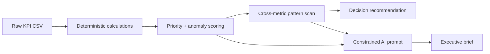

# 📊 Decision Brief Generator

An **AI decision-intelligence prototype** that turns raw KPI data into prioritized signals, cross-metric patterns, and recommended business actions.

Instead of asking an LLM to do everything, the prototype deliberately separates **calculation** from **interpretation**: Python handles the auditable math, while a constrained AI-ready prompt turns verified signals into executive language.

## What the prototype does

- Upload any time-series KPI CSV, or use the included dummy dataset.
- Compares the latest period with the previous period.
- Scores each KPI from **0–100** using movement magnitude, historical unusualness, and business direction.
- Flags simple anomalies using a historical z-score.
- Detects **cross-metric patterns** such as rising ad spend with falling revenue.
- Produces three prioritized takeaways and a **Decision now** recommendation.
- Separates **evidence** from **hypotheses** to reduce unsupported causal claims.
- Generates an AI-ready executive prompt with explicit guardrails and confidence labeling.
- Includes an interactive trend explorer and a transparent explanation of the method.

## Why this design

A useful analyst should not simply describe numbers. It should help a decision-maker answer:

1. **What changed?**
2. **What matters most?**
3. **What patterns are supported by multiple metrics?**
4. **What is evidence versus an unverified hypothesis?**
5. **What should we do next?**

The prototype is intentionally hybrid: deterministic analytics establish the facts, then AI is used where it adds the most value—prioritization, synthesis, and communication.



## AI guardrails

- **No invented causality:** detected relationships are labeled as hypotheses, not facts.
- **Auditable calculations:** period changes and anomaly scores are computed in Python.
- **Traceable recommendations:** every action is linked to a supplied KPI or explicit rule.
- **Confidence-aware output:** the generated prompt asks the AI to state its confidence.
- **Human judgment remains:** anomaly detection is a diagnostic flag, not proof of root cause.

## Demo dataset

The included [`sample_data.csv`](https://github.com/theyoumnahassan/challenge1/blob/main/sample_data.csv) is a **self-created dummy e-commerce KPI dataset**. No confidential information is used.

It contains monthly examples for revenue, orders, conversion rate, ad spend, churn, average order value, and support tickets.

## Run locally

```bash
pip install -r requirements.txt
streamlit run app.py
```

## Deploy publicly with Streamlit

1. Connect this repository to Streamlit Community Cloud.
2. Select `app.py` as the entry point.
3. Deploy the app.
4. Submit the resulting `streamlit.app` URL together with this GitHub repository.

## Submission Summary — exactly 100 words

I built a lightweight Decision Brief Generator that turns raw KPI data into a concise, action-oriented business summary. The prototype accepts a CSV, compares the latest period with the previous one, ranks the largest metric movements, and produces three key takeaways plus recommended actions. I deliberately separated calculation from interpretation: Python handles deterministic metric changes, while an AI-ready prompt converts those facts into executive language and explicitly avoids inventing unsupported causes. I used a self-created e-commerce dataset so no confidential information is involved. The design is simple, auditable, reusable across business datasets, and easy to deploy as a Streamlit app.

## Tech stack

- Python
- Pandas / NumPy
- Streamlit
- Prompt engineering for executive synthesis

## Repository files

- `app.py` — interactive decision-intelligence prototype
- `sample_data.csv` — self-created demo dataset
- `requirements.txt` — dependencies
- `README.md` — method, setup, and submission summary

---

**Challenge:** Decision Brief Generator  
**Goal:** Turn raw data into concise insights and recommended business actions without hiding the reasoning behind the output.
